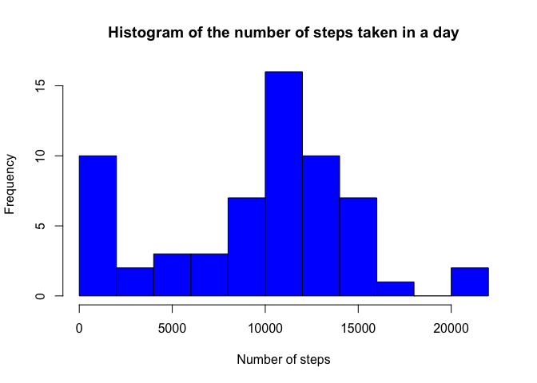
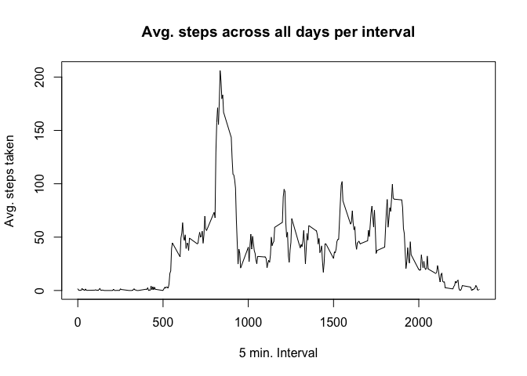
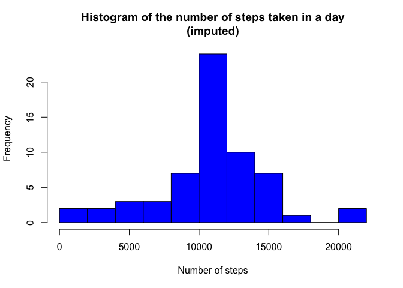
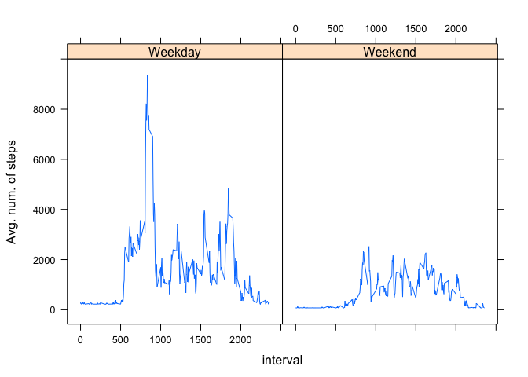

# Reproducible Research: Peer Assessment 1

##Loading and Preprocessing the data


```r
library(dplyr)
```

```
## 
## Attaching package: 'dplyr'
## 
## The following objects are masked from 'package:stats':
## 
##     filter, lag
## 
## The following objects are masked from 'package:base':
## 
##     intersect, setdiff, setequal, union
```

```r
library(lattice)

zipfilename<-paste(getwd(),"activity.zip",sep="/")
#Download the activity zip file from the course website if it doesn't already exist in your working directory
if (!file.exists(zipfilename)){
  download.file(url="https://d396qusza40orc.cloudfront.net/repdata%2Fdata%2Factivity.zip",destfile='./activity.zip',method="curl")
}

#Unzip the activity.zip file if not already unzipped
if (!file.exists('activity.csv')){  
  unzip("./activity.zip")
}

#Read the activity data into a data frame
df_activity<-read.csv(file='activity.csv', header=TRUE)
```

##What is the mean total number of steps taken per day?

##### Q1. Calculate the total number of steps taken per day

```r
df_activity %>%
  group_by(date) %>%
    summarize(numsteps=sum(steps,na.rm=TRUE))->df1
```

##### Q2. Make a histogram of the total number of steps taken each day

```r
hist(df1$numsteps, breaks=8, col='blue', xlab='Number of steps',ylab='Frequency',main='Histogram of the number of steps taken in a day')
```

 

##### Q3. Calculate and report the mean and median of the total number of steps taken per day
* Answer: The mean total number of steps taken per day is: 9354
* Answer: The median total number of steps taken per day is: 10395

##What is the average daily activity pattern?

##### Q1. Make a time series plot of the 5-minute interval (x-axis) and the average number of steps taken, averaged across all days (y-axis)

```r
df_activity %>%
  group_by(interval) %>%
    summarize(avgsteps=mean(steps,na.rm=TRUE))->df3
plot(df3$interval,df3$avgsteps,xlab='5 min. Interval',
                        ylab='Avg. steps taken', type="l", main="Avg. steps across all days per interval")
```

 

##### Q2. Which 5-minute interval, on average across all the days in the dataset, contains the maximum number of steps?

```r
#find the maximum avg. steps from dataframe df3, which is grouped by interval
df3[which(df3$avgsteps == max(df3$avgsteps)),'interval']
```

Answer: Interval 835 contains the maximum number of steps, on average across all the days


##Imputing missing values

##### Q1. Calculate and report the total number of missing values in the dataset (i.e. the total number of rows with NAs)

```r
#Use complete.cases to return a vector of any observations (rows) with missing values
length(which(!complete.cases(df_activity)))
```

Answer: There are 2304 number of missing values in the data set


##### Q2. Devise a strategy for filling in all of the missing values in the dataset. The strategy does not need to be sophisticated. For example, you could use the mean/median for that day, or the mean for that 5-minute interval, etc.
Answer: To fill in the missing values of the dataset, use the average number of steps in a day as a representative for a five minute interval. For example, use the mean number of steps for day dd-mm-yyyy, where it exists; otherwise, use the average number of steps for the whole dataset. 

##### Q3. Create a new dataset that is equal to the original dataset but with the missing data filled in.
Answer: A new dataset,dfjoined, is created with the following code

```r
#Summarise the mean number of steps taken for each day
df_activity %>%
  group_by(date) %>%
    summarize(avgsteps=mean(steps,na.rm=TRUE))->df2
#Calculate the mean of means across all days; data is already grouped by days in df2
dailymean_of_means<-mean(df2$avgsteps, na.rm=TRUE)
#Assign the mean of means to those days in df2 where average steps is missing
df2[which(is.na(df2$avgsteps)),2]<-dailymean_of_means
#Join the original dataset to df2, using the date
dfjoined<-inner_join(df_activity,df2, by=c('date' = 'date'))
#Assign the avg. steps to the steps observation
dfjoined[which(is.na(dfjoined$steps)),'steps']=dfjoined[which(is.na(dfjoined$steps)),'avgsteps']
#To create an equivalent dataset, we only need the first three columns
dfjoined<-select(dfjoined, 1:3)
#Print out the first five rows, 947th-957th rows and the final five rows to show
#which dates have imputed steps.
dfjoined[c(1:5,947:957, (nrow(dfjoined)-5):nrow(dfjoined)),]
```

```
##          steps       date interval
## 1      37.3826 2012-10-01        0
## 2      37.3826 2012-10-01        5
## 3      37.3826 2012-10-01       10
## 4      37.3826 2012-10-01       15
## 5      37.3826 2012-10-01       20
## 947    29.0000 2012-10-04      650
## 948    59.0000 2012-10-04      655
## 949     7.0000 2012-10-04      700
## 950    25.0000 2012-10-04      705
## 951    30.0000 2012-10-04      710
## 952    31.0000 2012-10-04      715
## 953     7.0000 2012-10-04      720
## 954    18.0000 2012-10-04      725
## 955   113.0000 2012-10-04      730
## 956   181.0000 2012-10-04      735
## 957    87.0000 2012-10-04      740
## 17563  37.3826 2012-11-30     2330
## 17564  37.3826 2012-11-30     2335
## 17565  37.3826 2012-11-30     2340
## 17566  37.3826 2012-11-30     2345
## 17567  37.3826 2012-11-30     2350
## 17568  37.3826 2012-11-30     2355
```

##### Q4a. Make a histogram of the total number of steps taken each day and calculate and report the mean and median total number of steps taken per day. Do these values differ from the estimates from the first part of the assignment? 

```r
dfjoined %>%
  group_by(date) %>%
    summarize(numsteps=sum(steps,na.rm=TRUE))->df4
#par(mfrow=c(1,2))
hist(df4$numsteps, breaks=8, col='blue', xlab='Number of steps',ylab='Frequency',main='Histogram of the number of steps taken in a day\n(imputed)')
```

 

* Answer: The mean total number of steps taken per day is: 10766 compared to the previous answer 9354
* Answer: The median total number of steps taken per day is: 10766 compared to the previous answer 10395

##### Q4b. What is the impact of imputing missing data on the estimates of the total daily number of steps?
Answer: It has pushed the average statistics a little bit higher.

##Are there differences in activity patterns between weekdays and weekends?

##### Q1.Create a new factor variable in the dataset with two levels – “weekday” and “weekend” indicating whether a given date is a weekday or weekend day.

```r
dfnew<-mutate(dfjoined,datetype=ifelse(as.POSIXlt(dfjoined$date)$wday %in% c(1,2,3,4,5),"Weekday","Weekend"))
```

##### Q2. Make a panel plot containing a time series plot (i.e. type = "l") of the 5-minute interval (x-axis) and the average number of steps taken, averaged across all weekday days or weekend days (y-axis).


```r
#Summarize data by interval and datetype(Weekday/Weekend)

dfnew %>%
  group_by(interval,datetype) %>%
    summarize(numsteps=sum(steps,na.rm=TRUE))->df4
xyplot(numsteps ~ interval|datetype, data = df4, type='l',ylab='Avg. num. of steps')
```

 
